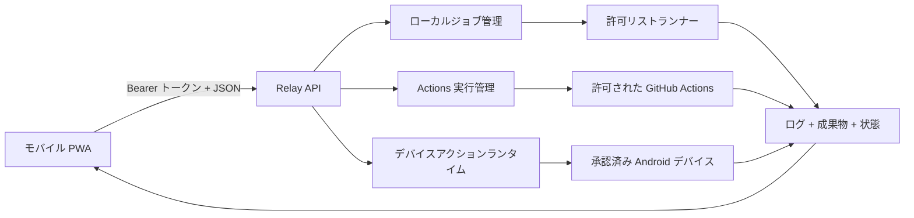

# PocketForge Relay

> ワークステーションではなく、コントロールプレーンを持ち歩こう。

[English](README.md) · [한국어](README.ko.md) · **日本語**

PocketForge Relay は、スマートフォンからソフトウェアのビルドを開始・
監視・検証するための、オープンソースでモバイルファーストな
コントロールプレーンです。実際の処理はローカル PC、セルフホスト
サーバー、またはクラウドランナーで実行されます。

スマートフォンはノート PC をまねるのではなく、開発ループを指揮する
べきです。

## このプロジェクトが必要な理由

モバイルエディター、リモートシェル、ホスト型ワークスペース、
コーディングエージェントは、モバイル開発の一部分だけを解決します。
PocketForge Relay は、プロバイダーに依存しない次のループを接続します。

```text
変更 → ビルド → テスト → 成果物 → 検証 → 反復
```

Android Studio、VS Code、Termux、Codex、Claude Code、CI を置き換える
IDE ではありません。明示的なアダプターと制限されたランナー機能で、
既存ツールを調整するコントロールプレーンです。

## 現在動作する MVP

- 英語・韓国語・日本語対応のモバイルファーストなインストール可能 PWA
- API ルートの Bearer トークン認証
- 制限付きインメモリジョブキューと完了ジョブ保持
- ジョブごとの分離ワークスペース
- 任意のシェル入力ではなく許可リスト形式のビルドプリセット
- Server-Sent Events によるログと状態の配信
- 認証付き成果物ダウンロード
- 外部パッケージ不要の同梱デモ
- Node.js、Android Gradle、CMake プリセット
- 子プロセス環境変数の許可リストと防御的な秘密情報のマスキング
- 実行中プロセスと成果物確定を待つ正常終了
- 許可された GitHub Actions ターゲットへの二段階承認ディスパッチ
- レビュー済み APK スナップショット、ワンタイム承認、認証付き
  エビデンス取得、再起動時の復元、明示的削除を備えた任意の Android
  デバイスエビデンス経路

Actions と Android 連携はデフォルトで無効です。Android PWA の承認画面は
記録済みのリポジトリ・確定コミットと、APK ダイジェスト、パッケージ・
バージョン、不透明なデバイス識別子を先に表示します。承認シークレットは
ブラウザーメモリーだけに保持され、API は ADB コマンドやファイルパスを
入力として受け取りません。

プロセスランナーは強化されたサンドボックスでは **ありません**。
コンテナーまたはマイクロ VM 分離が実装されるまでは、信頼できる
リポジトリだけを実行してください。

## クイックスタート

要件: Node.js 22 以降、Git

```powershell
$env:POCKETFORGE_TOKEN = "十分に長いランダムなトークン"
npm start
```

<http://127.0.0.1:8787> を開き、トークンを入力して
**Bundled web demo** を実行してください。デモは次の成果物を返します。

- `dist/index.html`
- `dist/build-report.json`
- `.pocketforge-result/build-summary.json`

同じ信頼済みネットワーク上のスマートフォンから接続する場合:

```powershell
$env:POCKETFORGE_TOKEN = "十分に長いランダムなトークン"
$env:HOST = "0.0.0.0"
npm start
```

次に `http://<PC-LAN-IP>:8787` へアクセスします。現在の MVP を公開
インターネットへ直接公開しないでください。

## 検証

```powershell
npm run check
npm test
```

実装済みの機能と、特定環境で実際に実行した機能を区別します。現在の
証拠は [`docs/VERIFICATION.md`](docs/VERIFICATION.md) を参照してください。
未実行の Android SDK/JDK ビルド、物理端末へのインストール・起動・
logcat・スクリーンショット、実際の GitHub Actions 呼び出しは
`NOT RUN` のままです。

Actions と Android 連携の設定は
[`docs/GITHUB_ACTIONS.md`](docs/GITHUB_ACTIONS.md)、
[`docs/ANDROID_DEVICE_EVIDENCE.md`](docs/ANDROID_DEVICE_EVIDENCE.md)、
[`docs/CONFIGURATION.md`](docs/CONFIGURATION.md) を参照してください。

## 構成



拡張点は `SourceAdapter`、`RunnerAdapter`、`AgentAdapter`、
`ArtifactAdapter`、`DeviceAdapter`、`PolicyAdapter` です。詳細な契約は
[`docs/`](docs/) にあります。

## 現在の境界

現在の自動テストだけでは、次の項目を証明しません。

- 信頼できないリポジトリ向けの強化された隔離
- 実際の Android SDK/JDK またはネイティブ CMake ツールチェーンビルド
- 物理 Android デバイスへのインストール・起動・logcat・crash・
  スクリーンショット収集
- マルチユーザー認可または非公開リポジトリアクセス
- 実際の GitHub Actions 実行・キャンセル・リモート成果物取得

自動テストは Actions・Android アダプター契約、認証 API、モバイル UI
契約、翻訳の同等性をフェイクとローカルフィクスチャで検査します。実際の
Android SDK・デバイス検査とライブ GitHub Actions 検査は、現在の環境では
**NOT RUN** です。

## コントリビューション

小さくレビュー可能なアダプター、パーサー、サンプル、テスト、
セキュリティ改善、文書修正を歓迎します。参加前に
[`CONTRIBUTING.md`](CONTRIBUTING.md) と [`SECURITY.md`](SECURITY.md) を
お読みください。翻訳ルールは
[`docs/LOCALIZATION.md`](docs/LOCALIZATION.md) にあります。

## ライセンス

Apache License 2.0。[`LICENSE`](LICENSE) を参照してください。
