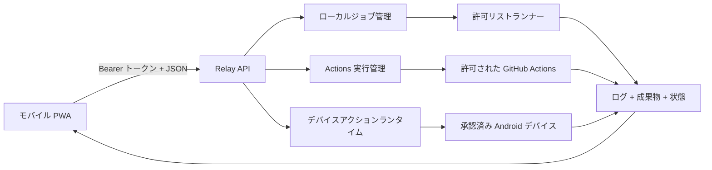

# PocketForge Relay

> ワークステーションではなく、コントロールプレーンを持ち歩こう。

[English](README.md) · [한국어](README.ko.md) · **日本語**

[動作する MVP](#現在動作する-mvp) ·
[AI の方向性](#方向性-エビデンス中心の-ai-開発ループ) ·
[貢献する](#コントリビューション)

PocketForge Relay は、スマートフォンからソフトウェアのビルドを開始・
監視・検証するための、オープンソースでモバイルファーストな
コントロールプレーンです。実際の処理はローカル PC、セルフホスト
サーバー、またはクラウドランナーで実行されます。

スマートフォンはノート PC をまねるのではなく、開発ループを指揮する
べきです。

## このプロジェクトが必要な理由

モバイルエディター、リモートシェル、ホスト型ワークスペース、
コーディングエージェントは、モバイル開発の一部分だけを解決します。
PocketForge Relay は、プロバイダーに依存しない次のループを接続します。

```text
変更 → ビルド → テスト → 成果物 → 検証 → 反復
```

Android Studio、VS Code、Termux、Codex、Claude Code、CI を置き換える
IDE ではありません。明示的なアダプターと制限されたランナー機能で、
既存ツールを調整するコントロールプレーンです。

リモートシェルはコマンドアクセスを、ホスト型ワークスペースは実行環境を、
コーディングエージェントは変更提案を、CI はワークフロー実行を提供します。
PocketForge Relay は、それらの間のレビュー、制限された実行、エビデンス
契約を接続します。

## 方向性: エビデンス中心の AI 開発ループ

AI は数秒でパッチを提案できますが、ソフトウェアを届けるには、人間の
意図から正確なソース、制限された実行、成果物、ランタイムエビデンスまで
を結ぶ信頼できる連鎖が必要です。PocketForge Relay は、この連鎖を検査
可能かつプロバイダー非依存にすることを目指します。

```text
人間の意図 → AI 支援の提案 → 明示的レビュー → 許可リストのアダプター
           → ビルドまたはデバイスのエビデンス → 人間の判断 → 反復
```

現在の MVP に AI エージェントアダプターは **実装されていません**。
長期目標は、無制限のシェルを持つ自律エージェントではなく、将来の
アダプターが人間の統制する調整レイヤーで次の作業を支援することです。

- Issue を分類し、再現可能なエビデンスを制限された作業提案に変換する
- ビルド・デバイスログを分類し、自動実行せずに次の確認項目を提案する
- 未知のビルド環境向けにアダプター適合性テストを生成する
- セキュリティ境界の変更をレビューし、翻訳文書の意味を同期する
- 推測した成功ではなく、実行済み検証からリリースノートを下書きする
- 新しいコントリビューターが小さく検証可能な最初の作業を見つけられる
  よう支援する

将来のすべての AI 支援アクションは、リレーの中核契約を継承します。
クライアント文字列を任意のシェル命令にせず、権限を既定で最小化し、
Actions 実行、Android インストール、将来のマージ・リリース・デプロイに
明示的承認を求めます。リレー管理ログには防御的な秘密情報のマスキングを
適用しますが、リポジトリが生成する成果物は信頼したリポジトリの出力で、
秘密情報がないことを保証しません。デバイスエビデンスは共有前に
プライバシーレビューが必要で、結果は `PASS`、`FAIL`、`NOT RUN` を
正直に区別しなければなりません。

AI の提案は信頼できない入力として扱い、同じ許可リストとレビューを通過
させます。ソース、ログ、スクリーンショット、エビデンスを外部 AI
プロバイダーへ送るには運用者の明示的なオプトインが必要で、リレーは既定で
それらを送信しません。

## オープンソース計画

- **現在:** モバイルの要求→成果物ループ、契約テスト済みでデフォルト無効の
  Actions・Android エビデンス経路、EN/KO/JA のコントリビューター体験を
  実証します。
- **次:** 信頼できる外部 Node.js プロジェクトを検証し、アダプター
  プロトコルのバージョン管理、イベント永続化、失敗パーサー、ルートレス
  コンテナー境界を追加します。
- **将来:** インストール・マージ・リリース・デプロイの人間による承認を
  維持しながら、AI 支援修正ブランチ、署名付きユーザー・デバイスペアリング、
  来歴証明（provenance）、ポリシーアダプターを支援します。

進捗はコミット数やモデル名ではなく、再現可能なパイロット報告、有用な
外部アダプター、外部貢献、リリース、解決済みメンテナー Issue で測ります。
エビデンス駆動の [`ROADMAP.md`](ROADMAP.md) と
[`オープンソース申請概要`](docs/OPEN_SOURCE_APPLICATION.md)を参照してください。

## 現在動作する MVP

- 英語・韓国語・日本語対応のモバイルファーストなインストール可能 PWA
- API ルートの Bearer トークン認証
- 制限付きインメモリジョブキューと完了ジョブ保持
- ジョブごとの分離ワークスペース
- 任意のシェル入力ではなく許可リスト形式のビルドプリセット
- Server-Sent Events によるログと状態の配信
- 認証付き成果物ダウンロード
- 外部パッケージ不要の同梱デモ
- Node.js、Android Gradle、CMake プリセット
- 子プロセス環境変数の許可リストと防御的な秘密情報のマスキング
- 実行中プロセスと成果物確定を待つ正常終了
- 正確なターゲット・ref 許可リスト、有効期限付き承認、状態・キャンセル
  API、制限付き ZIP エビデンス取得を備えた任意の GitHub Actions アダプター
- レビュー済み APK スナップショット、ワンタイム承認、認証付き
  エビデンス取得、再起動時の復元、明示的削除を備えた任意の Android
  デバイスエビデンス経路

Actions と Android 連携はデフォルトで無効です。Android PWA の承認画面は
記録済みのリポジトリ・確定コミットと、APK ダイジェスト、パッケージ・
バージョン、不透明なデバイス識別子を先に表示します。承認シークレットは
ブラウザーメモリーだけに保持され、API は ADB コマンドやファイルパスを
入力として受け取りません。

プロセスランナーは強化されたサンドボックスでは **ありません**。
コンテナーまたはマイクロ VM 分離が実装されるまでは、信頼できる
リポジトリだけを実行してください。

## クイックスタート

要件: Node.js 22 以降、Git

```powershell
$env:POCKETFORGE_TOKEN = "十分に長いランダムなトークン"
npm start
```

<http://127.0.0.1:8787> を開き、トークンを入力して
**Bundled web demo** を実行してください。デモは次の成果物を返します。

- `dist/index.html`
- `dist/build-report.json`
- `.pocketforge-result/build-summary.json`

同じ信頼済みネットワーク上のスマートフォンから接続する場合:

```powershell
$env:POCKETFORGE_TOKEN = "十分に長いランダムなトークン"
$env:HOST = "0.0.0.0"
npm start
```

次に `http://<PC-LAN-IP>:8787` へアクセスします。現在の MVP を公開
インターネットへ直接公開しないでください。

## 検証

```powershell
npm run check
npm test
```

実装済みの機能と、特定環境で実際に実行した機能を区別します。現在の
証拠は [`docs/VERIFICATION.md`](docs/VERIFICATION.md) を参照してください。
未実行の Android SDK/JDK ビルド、物理端末へのインストール・起動・
logcat・スクリーンショット、実際の GitHub Actions 呼び出しは
`NOT RUN` のままです。

Actions と Android 連携の設定は
[`docs/GITHUB_ACTIONS.md`](docs/GITHUB_ACTIONS.md)、
[`docs/ANDROID_DEVICE_EVIDENCE.md`](docs/ANDROID_DEVICE_EVIDENCE.md)、
[`docs/CONFIGURATION.md`](docs/CONFIGURATION.md) を参照してください。

## 構成



拡張点は `SourceAdapter`、`RunnerAdapter`、`AgentAdapter`、
`ArtifactAdapter`、`DeviceAdapter`、`PolicyAdapter` です。詳細な契約は
[`docs/`](docs/) にあります。

## 現在の境界

現在の自動テストだけでは、次の項目を証明しません。

- 信頼できないリポジトリ向けの強化された隔離
- 実際の Android SDK/JDK またはネイティブ CMake ツールチェーンビルド
- 物理 Android デバイスへのインストール・起動・logcat・crash・
  スクリーンショット収集
- マルチユーザー認可または非公開リポジトリアクセス
- 実際の GitHub Actions 実行・キャンセル・リモート成果物取得

自動テストは Actions・Android アダプター契約、認証 API、モバイル UI
契約、翻訳の同等性をフェイクとローカルフィクスチャで検査します。実際の
Android SDK・デバイス検査とライブ GitHub Actions 検査は、現在の環境では
**NOT RUN** です。

## コントリビューション

小さくレビュー可能なアダプター、パーサー、サンプル、テスト、
セキュリティ改善、文書修正を歓迎します。参加前に
[`CONTRIBUTING.md`](CONTRIBUTING.md) と [`SECURITY.md`](SECURITY.md) を
お読みください。翻訳ルールは
[`docs/LOCALIZATION.md`](docs/LOCALIZATION.md) にあります。

最初の貢献には、アダプター適合性テスト用フィクスチャ、失敗パーサーテスト、
アクセシビリティ・翻訳修正、機密情報を除いた再現可能なパイロット報告が
適しています。実装を約束または割り当てる前にメンテナーが範囲を確認します。

[範囲を限定した最初の Issue を提案](https://github.com/sheryloe/pocketforge-relay/issues/new?template=good-first-issue.yml)するか、
[パイロット報告フォーム](https://github.com/sheryloe/pocketforge-relay/issues/new?template=pilot-report.yml)から
実行済みエビデンスを提出してください。範囲が不明確な場合は、大きなパッチを
書く前に提案 Issue を開いてください。

## ライセンス

Apache License 2.0。[`LICENSE`](LICENSE) を参照してください。
