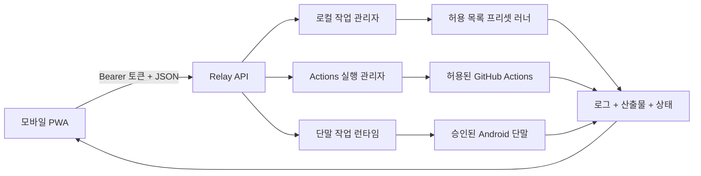

# PocketForge Relay

> 워크스테이션이 아니라 제어면을 휴대하세요.

[English](README.md) · **한국어** · [日本語](README.ja.md)

PocketForge Relay는 휴대전화에서 소프트웨어 빌드를 시작하고, 관찰하고,
검증하는 오픈 소스 모바일 우선 제어면입니다. 실제 작업은 로컬 PC, 자체
호스팅 서버 또는 클라우드 러너에서 실행됩니다.

휴대전화는 노트북을 흉내 내는 대신 개발 루프를 지휘해야 합니다.

## 이 프로젝트가 필요한 이유

모바일 편집기, 원격 셸, 호스팅 워크스페이스와 코딩 에이전트는 모바일
개발의 일부만 해결합니다. PocketForge Relay는 공급자에 종속되지 않는
증거 루프를 연결합니다.

```text
변경 → 빌드 → 테스트 → 산출물 → 검증 → 반복
```

Android Studio, VS Code, Termux, Codex, Claude Code 또는 CI를 대체하지
않습니다. 명시적인 어댑터와 제한된 러너 기능으로 기존 도구를 조율합니다.

## 현재 동작하는 MVP

- 영어·한국어·일본어를 지원하는 모바일 우선 설치형 PWA
- API 경로의 Bearer 토큰 인증
- 대기·실행·로그·산출물·완료 기록의 명시적 제한
- 작업별 분리 워크스페이스
- 사용자 셸 명령 대신 허용 목록 빌드 프리셋
- Server-Sent Events 기반 로그와 상태 전송
- 인증된 산출물 다운로드와 외부 패키지가 필요 없는 번들 데모
- Node.js, Android Gradle, CMake 프리셋
- 자식 프로세스 환경 변수 허용 목록, 방어적 비밀 제거, 프로세스와
  산출물 마무리를 기다리는 비동기 정상 종료
- 정확한 대상·ref 허용 목록, 만료 승인, 상태·취소 API, 제한된 ZIP 증거
  다운로드를 갖춘 선택적 GitHub Actions 어댑터
- 검토된 APK 스냅숏, 일회성 승인, 인증된 증거 다운로드, 재시작 복구,
  명시적 증거 삭제를 갖춘 선택적 Android 단말 증거 경로

Actions와 Android 연동은 기본적으로 비활성화됩니다. Android PWA 승인
화면은 기록된 저장소·확정 커밋과 APK 해시, 패키지·버전, 불투명 단말
식별자를 먼저 보여 줍니다. 승인 비밀은 브라우저 메모리에만 남고, API는 ADB 명령이나
파일 경로를 입력으로 받지 않습니다.

프로세스 러너는 강화된 샌드박스가 **아닙니다**. 컨테이너 또는 마이크로
VM 격리가 구현될 때까지 신뢰할 수 있는 저장소만 실행하세요.

## 빠른 시작

요구 사항: Node.js 22 이상, Git

```powershell
$env:POCKETFORGE_TOKEN = "충분히-길고-무작위인-토큰"
npm start
```

<http://127.0.0.1:8787>을 열고 토큰을 입력한 뒤 **Bundled web demo**를
선택해 실행하세요. 데모는 다음 산출물을 반환합니다.

- `dist/index.html`
- `dist/build-report.json`
- `.pocketforge-result/build-summary.json`

같은 신뢰 네트워크의 휴대전화에서 접속하려면 다음과 같이 실행합니다.

```powershell
$env:POCKETFORGE_TOKEN = "충분히-길고-무작위인-토큰"
$env:HOST = "0.0.0.0"
npm start
```

그다음 `http://<PC-LAN-IP>:8787`에 접속합니다. 현재 MVP를 공용 인터넷에
직접 노출하지 마세요.

Actions와 Android 연동 설정은
[`docs/GITHUB_ACTIONS.md`](docs/GITHUB_ACTIONS.md),
[`docs/ANDROID_DEVICE_EVIDENCE.md`](docs/ANDROID_DEVICE_EVIDENCE.md),
[`docs/CONFIGURATION.md`](docs/CONFIGURATION.md)를 확인하세요.

## 검증

```powershell
npm run check
npm test
```

구현된 기능과 특정 환경에서 실제 실행한 기능을 구분합니다. 현재 증거는
[`docs/VERIFICATION.md`](docs/VERIFICATION.md)를 확인하세요.

## 구조



상세 계약과 신뢰 경계는 [`docs/`](docs/)에 있습니다.

## 현재 경계

자동화 테스트는 로컬 조율, Actions·Android 어댑터 계약, 인증 API, 모바일
UI 계약과 번역 동등성을 가짜 도구와 로컬 픽스처로 검사합니다. 이것만으로
다음을 입증하지 않습니다.

- 신뢰하지 않는 저장소를 위한 강화된 격리
- 실제 Android SDK/JDK 빌드
- 물리 Android 단말 설치·실행·logcat·crash·스크린샷 수집
- 실제 GitHub Actions 실행·취소·원격 산출물 다운로드
- 실제 프로젝트별 네이티브 CMake 빌드
- 다중 사용자 권한, 비공개 저장소 접근, 공용 인터넷 안전성

실제 Android SDK·단말 검사와 라이브 GitHub Actions 검사는 현재 환경에서
**NOT RUN**입니다. 단위 테스트만으로 작동한다고 표현해서는 안 됩니다.

## 기여

작고 검토 가능한 어댑터, 파서, 예제, 테스트, 보안 개선과 문서 수정은
환영합니다. 기여 전에 [`CONTRIBUTING.md`](CONTRIBUTING.md)와
[`SECURITY.md`](SECURITY.md)를 읽어 주세요. 번역 규칙은
[`docs/LOCALIZATION.md`](docs/LOCALIZATION.md)를 따릅니다.

## 라이선스

Apache License 2.0. [`LICENSE`](LICENSE)를 확인하세요.
