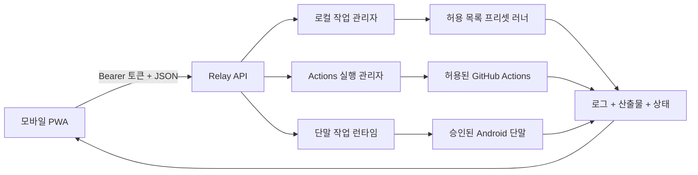

# PocketForge Relay

> 워크스테이션이 아니라 제어면을 휴대하세요.

[English](README.md) · **한국어** · [日本語](README.ja.md)

[동작하는 MVP](#현재-동작하는-mvp) ·
[AI 방향](#방향-증거-중심-ai-개발-루프) ·
[기여하기](#기여)

PocketForge Relay는 휴대전화에서 소프트웨어 빌드를 시작하고, 관찰하고,
검증하는 오픈 소스 모바일 우선 제어면입니다. 실제 작업은 로컬 PC, 자체
호스팅 서버 또는 클라우드 러너에서 실행됩니다.

휴대전화는 노트북을 흉내 내는 대신 개발 루프를 지휘해야 합니다.

## 이 프로젝트가 필요한 이유

모바일 편집기, 원격 셸, 호스팅 워크스페이스와 코딩 에이전트는 모바일
개발의 일부만 해결합니다. PocketForge Relay는 공급자에 종속되지 않는
증거 루프를 연결합니다.

```text
변경 → 빌드 → 테스트 → 산출물 → 검증 → 반복
```

Android Studio, VS Code, Termux, Codex, Claude Code 또는 CI를 대체하지
않습니다. 명시적인 어댑터와 제한된 러너 기능으로 기존 도구를 조율합니다.

원격 셸은 명령 접근을, 호스팅 워크스페이스는 실행 환경을, 코딩 에이전트는
변경 제안을, CI는 워크플로 실행을 제공합니다. PocketForge Relay는 이들
사이의 검토, 제한된 실행, 증거 계약을 연결합니다.

## 방향: 증거 중심 AI 개발 루프

AI는 몇 초 만에 패치를 제안할 수 있지만, 소프트웨어를 전달하려면 사람의
의도에서 정확한 소스, 제한된 실행, 산출물, 런타임 증거까지 이어지는 신뢰할
수 있는 사슬이 필요합니다. PocketForge Relay는 이 사슬을 검토 가능하고
특정 공급자에 종속되지 않게 만드는 것을 목표로 합니다.

```text
사람의 의도 → AI 보조 제안 → 명시적 검토 → 허용 목록 어댑터
            → 빌드 또는 단말 증거 → 사람의 결정 → 반복
```

현재 MVP에는 AI 에이전트 어댑터가 **구현되어 있지 않습니다**. 장기 목표는
제한 없는 셸을 가진 자율 에이전트가 아니라, 앞으로 구현할 어댑터가 사람이
통제하는 조율 계층에서 다음 일을 돕도록 하는 것입니다.

- 이슈를 분류하고 재현 가능한 증거를 제한된 작업 제안으로 변환
- 빌드·단말 로그를 분류하고 자동 실행 없이 다음 확인 항목을 제안
- 익숙하지 않은 빌드 생태계를 위한 어댑터 적합성 테스트 생성
- 보안 경계 변경 검토와 번역 문서의 의미 일치 확인
- 추정된 성공이 아니라 실행된 검증에서 릴리스 노트 초안 작성
- 새 기여자가 작고 검증 가능한 첫 작업을 찾도록 안내

미래의 모든 AI 보조 작업은 릴레이의 핵심 계약을 그대로 따라야 합니다.
클라이언트 텍스트를 임의 셸 명령으로 실행하지 않고 기본 권한을 최소화하며,
Actions 실행, Android 설치, 향후 병합·릴리스·배포에는 명시적 승인을
요구합니다. 릴레이가 관리하는 로그에는 방어적 비밀정보 마스킹을 적용하지만,
저장소가 생성한 산출물은 신뢰한 저장소의 출력이며 비밀이 없음을 보장하지
않습니다. 단말 증거는 공유 전에 개인정보 검토가 필요하고 모든 결과는
`PASS`, `FAIL`, `NOT RUN`을 정직하게 구분해야 합니다.

AI 제안은 신뢰하지 않는 입력으로 취급하고 같은 허용 목록과 검토 단계를
통과시킵니다. 소스, 로그, 화면 캡처 또는 증거를 외부 AI 공급자에게 보내려면
운영자의 명시적 동의가 필요하며, 릴레이는 이를 기본으로 전송하지 않습니다.

## 오픈 소스 계획

- **현재:** 모바일 요청→산출물 루프, 계약 테스트를 거쳤고 기본적으로 비활성인
  Actions·Android 증거 경로, EN/KO/JA 기여 경험을 실제 증거로 입증합니다.
- **다음:** 신뢰할 수 있는 외부 Node.js 프로젝트를 검증하고, 어댑터
  프로토콜 버전 관리, 이벤트 영속화, 실패 파서, 루트리스 컨테이너 경계를
  추가합니다.
- **장기:** 설치·병합·릴리스·배포의 사람 승인을 유지하면서 AI 보조 수정
  브랜치, 서명된 사용자·단말 페어링, 출처 증명, 정책 어댑터를 지원합니다.

진척은 커밋 수나 모델 이름이 아니라 재현 가능한 파일럿 보고서, 유용한 외부
어댑터, 외부 기여, 릴리스, 해결된 유지관리 이슈로 측정합니다. 증거 중심
[`ROADMAP.md`](ROADMAP.md)와
[`오픈 소스 신청 요약`](docs/OPEN_SOURCE_APPLICATION.md)을 참고하세요.

## 현재 동작하는 MVP

- 영어·한국어·일본어를 지원하는 모바일 우선 설치형 PWA
- API 경로의 Bearer 토큰 인증
- 대기·실행·로그·산출물·완료 기록의 명시적 제한
- 작업별 분리 워크스페이스
- 사용자 셸 명령 대신 허용 목록 빌드 프리셋
- Server-Sent Events 기반 로그와 상태 전송
- 프로토콜 v1 요청·SSE envelope, 재시작 후 읽을 수 있는 작업 projection,
  중단 감사 기록의 안전한 종결
- 복구 작업의 로그·산출물 접근과 완료 작업의 기록·워크스페이스·로그·산출물
  스냅숏을 함께 지우는 명시적 삭제
- 인증된 산출물 다운로드와 외부 패키지가 필요 없는 번들 데모
- 릴레이 소유 산출물 스냅숏과 선택적 전용 키 HMAC-SHA256 매니페스트
- 고정 프리셋 단계를 위한 선택적 digest 고정·비루트·네트워크 차단 컨테이너
  경계(계약 테스트 완료, 실제 데몬 실행은 이 환경에서 `NOT RUN`)
- Node.js, Android Gradle, CMake 프리셋
- 자식 프로세스 환경 변수 허용 목록, 방어적 비밀정보 마스킹, 프로세스와
  산출물 마무리를 기다리는 비동기 정상 종료
- 정확한 대상·ref 허용 목록, 만료 승인, 상태·취소 API, 제한된 ZIP 증거
  다운로드를 갖춘 선택적 GitHub Actions 어댑터
- 검토된 APK 스냅숏, 일회성 승인, 인증된 증거 다운로드, 재시작 복구,
  명시적 증거 삭제를 갖춘 선택적 Android 단말 증거 경로

Actions와 Android 연동은 기본적으로 비활성화됩니다. Android PWA 승인
화면은 기록된 저장소·확정 커밋과 APK 해시, 패키지·버전, 불투명 단말
식별자를 먼저 보여 줍니다. 승인 비밀은 브라우저 메모리에만 남고, API는 ADB 명령이나
파일 경로를 입력으로 받지 않습니다.

프로세스 러너는 강화된 샌드박스가 **아닙니다**. 컨테이너 또는 마이크로
VM 격리가 구현될 때까지 신뢰할 수 있는 저장소만 실행하세요.

## 빠른 시작

요구 사항: Node.js 22 이상, Git

```powershell
$env:POCKETFORGE_TOKEN = "충분히-길고-무작위인-토큰"
npm start
```

<http://127.0.0.1:8787>을 열고 토큰을 입력한 뒤 **Bundled web demo**를
선택해 실행하세요. 데모는 다음 산출물을 반환합니다.

- `dist/index.html`
- `dist/build-report.json`
- `.pocketforge-result/build-summary.json`

같은 신뢰 네트워크의 휴대전화에서 접속하려면 다음과 같이 실행합니다.

```powershell
$env:POCKETFORGE_TOKEN = "충분히-길고-무작위인-토큰"
$env:HOST = "0.0.0.0"
npm start
```

그다음 `http://<PC-LAN-IP>:8787`에 접속합니다. 현재 MVP를 공용 인터넷에
직접 노출하지 마세요.

Actions와 Android 연동 설정은
[`docs/GITHUB_ACTIONS.md`](docs/GITHUB_ACTIONS.md),
[`docs/ANDROID_DEVICE_EVIDENCE.md`](docs/ANDROID_DEVICE_EVIDENCE.md),
[`docs/CONFIGURATION.md`](docs/CONFIGURATION.md)를 확인하세요.

## 검증

```powershell
npm run check
npm test
```

구현된 기능과 특정 환경에서 실제 실행한 기능을 구분합니다. 현재 증거는
[`docs/VERIFICATION.md`](docs/VERIFICATION.md)를 확인하세요.

## 구조



상세 계약과 신뢰 경계는 [`docs/`](docs/)에 있습니다.

## 현재 경계

자동화 테스트는 로컬 조율, Actions·Android 어댑터 계약, 인증 API, 모바일
UI 계약과 번역 동등성을 가짜 도구와 로컬 픽스처로 검사합니다. 이것만으로
다음을 입증하지 않습니다.

- 신뢰하지 않는 저장소를 위한 강화된 격리
- 실제 Android SDK/JDK 빌드
- 물리 Android 단말 설치·실행·logcat·crash·스크린샷 수집
- 실제 GitHub Actions 취소와 비공개 저장소 접근
- 실제 프로젝트별 네이티브 CMake 빌드
- 다중 사용자 권한, 비공개 저장소 접근, 공용 인터넷 안전성

허용 목록의 공개 저장소 워크플로 하나는 실제로 실행·추적했고 로그·증거 ZIP을
릴레이를 통해 내려받아 digest를 확인했습니다. 실제 취소는 `NOT RUN`입니다.
Android SDK·단말 검사도 `NOT RUN`이며 계약 테스트로 성공을 추론하지 않습니다.

## 기여

작고 검토 가능한 어댑터, 파서, 예제, 테스트, 보안 개선과 문서 수정은
환영합니다. 기여 전에 [`CONTRIBUTING.md`](CONTRIBUTING.md)와
[`SECURITY.md`](SECURITY.md)를 읽어 주세요. 번역 규칙은
[`docs/LOCALIZATION.md`](docs/LOCALIZATION.md)를 따릅니다.

좋은 첫 기여에는 어댑터 적합성 테스트 픽스처, 실패 파서 테스트, 접근성·번역 수정,
민감 정보를 제거한 재현 가능한 파일럿 보고서가 포함됩니다. 구현을 약속하거나
배정하기 전에 유지관리자가 범위를 확인합니다.

[범위가 제한된 첫 이슈를 제안](https://github.com/sheryloe/pocketforge-relay/issues/new?template=good-first-issue.yml)하거나
[파일럿 보고서 양식](https://github.com/sheryloe/pocketforge-relay/issues/new?template=pilot-report.yml)으로
실행 증거를 제출하세요. 범위가 불명확하면 큰 패치를 작성하기 전에 먼저
제안 이슈를 열어 주세요.

## 라이선스

Apache License 2.0. [`LICENSE`](LICENSE)를 확인하세요.
