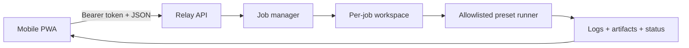

# PocketForge Relay

> Carry the control plane, not the workstation.

PocketForge Relay is an open-source, mobile-first control plane for starting,
observing, and verifying software builds from a phone while the actual work runs
on a local, self-hosted, or cloud runner.

The phone should command the development loop, not imitate a laptop.

## Why this exists

Mobile editors, remote shells, hosted workspaces, and coding agents each solve a
part of mobile development. The missing piece is a provider-neutral loop that
connects intent to evidence:

```text
change -> build -> test -> artifact -> verify -> iterate
```

PocketForge Relay focuses on that loop. It is not a replacement for Android
Studio, VS Code, Termux, Codex, Claude Code, or CI. It is a control plane that can
coordinate those tools through explicit adapters and bounded runner capabilities.

## Working MVP

The current Node.js MVP includes:

- a mobile-first installable PWA;
- bearer-token authentication for API routes;
- a bounded in-memory job queue;
- a distinct workspace for every job;
- allowlisted build presets instead of arbitrary shell input;
- Server-Sent Events for logs and state changes;
- authenticated artifact downloads;
- a zero-dependency bundled demo;
- presets for Node.js, Android Gradle, and CMake repositories;
- input, path, size, timeout, and log-count limits.

The process runner is **not a hardened sandbox**. Only run trusted repositories
until container or micro-VM isolation is implemented.

## Quick start

Requirements: Node.js 22 or newer and Git.

```powershell
$env:POCKETFORGE_TOKEN = "replace-with-a-long-random-token"
npm start
```

Open <http://127.0.0.1:8787>, enter the token, connect, select **Bundled web
demo**, and launch the build loop. The demo returns `dist/index.html`,
`dist/build-report.json`, and `.pocketforge-result/build-summary.json`.

To connect from a phone on the same trusted network:

```powershell
$env:POCKETFORGE_TOKEN = "replace-with-a-long-random-token"
$env:HOST = "0.0.0.0"
npm start
```

Then visit `http://<PC-LAN-IP>:8787`. Do not expose the MVP directly to the
public internet.

## Verify

```powershell
npm run check
npm test
```

The repository distinguishes implemented behavior from behavior exercised in a
specific environment. See [the verification record](docs/VERIFICATION.md).

All supported environment variables and limits are listed in
[`docs/CONFIGURATION.md`](docs/CONFIGURATION.md). Explicit malformed or
out-of-range values stop startup rather than silently selecting a default.

## Architecture



The planned extension points are `SourceAdapter`, `RunnerAdapter`,
`AgentAdapter`, `ArtifactAdapter`, `DeviceAdapter`, and `PolicyAdapter`. Protocol
and architecture notes live under [`docs/`](docs/).

## Current boundaries

Implemented and locally verified behavior is listed in
[`docs/VERIFICATION.md`](docs/VERIFICATION.md). In particular, the current test
suite does not establish:

- hardened isolation for untrusted repositories;
- a real Android SDK/JDK build;
- a real native CMake toolchain build;
- installation on a physical Android device;
- multi-user authorization or private-repository access.

Those items remain roadmap work and must not be represented as verified.

## Contributing

Small, reviewable adapters, parsers, examples, tests, security improvements, and
documentation fixes are welcome. Read [`CONTRIBUTING.md`](CONTRIBUTING.md) and
the [`SECURITY.md`](SECURITY.md) reporting policy before contributing.

## License

Apache License 2.0. See [`LICENSE`](LICENSE).
