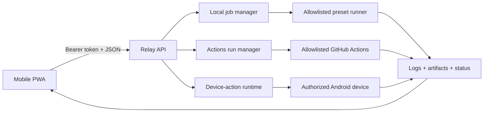

# PocketForge Relay

> Carry the control plane, not the workstation.

**English** · [한국어](README.ko.md) · [日本語](README.ja.md)

[Working MVP](#working-mvp) ·
[AI direction](#direction-an-evidence-first-ai-development-loop) ·
[Contribute](#contributing)

PocketForge Relay is an open-source, mobile-first control plane for starting,
observing, and verifying software builds from a phone while the actual work runs
on a local, self-hosted, or cloud runner.

The phone should command the development loop, not imitate a laptop.

## Why this exists

Mobile editors, remote shells, hosted workspaces, and coding agents each solve a
part of mobile development. PocketForge Relay connects the provider-neutral
evidence loop:

```text
change -> build -> test -> artifact -> verify -> iterate
```

It does not replace Android Studio, VS Code, Termux, Codex, Claude Code, or CI.
It coordinates those tools through explicit adapters and bounded runner
capabilities.

Remote shells provide command access, hosted workspaces provide a machine,
coding agents propose changes, and CI executes workflows. PocketForge Relay
connects review, bounded execution, and evidence across those categories.

## Direction: an evidence-first AI development loop

AI can propose a patch in seconds, but delivering software still requires a
trustworthy chain from human intent to exact source, bounded execution,
artifacts, and runtime evidence. PocketForge Relay aims to make that chain
inspectable and provider-neutral:

```text
human intent -> AI-assisted proposal -> explicit review -> allowlisted adapter
             -> build or device evidence -> human decision -> iterate
```

The current MVP does **not** include an AI-agent adapter. The target is not an
autonomous agent with an unrestricted shell; it is a human-governed coordination
layer where future adapters can:

- triage issues and turn reproducible evidence into a bounded work proposal;
- classify build and device logs and suggest the next check without silently
  acting on it;
- generate adapter conformance tests for unfamiliar build ecosystems;
- review security-boundary changes and keep translated documentation aligned;
- draft release notes from executed verification instead of inferred success;
  and
- help new contributors find a small, testable path into the project.

Every future AI-assisted action must preserve the relay's core contracts: no
arbitrary shell text from clients, least capability by default, and explicit
approval for Actions dispatch, Android installation, and future merge, release,
or deploy operations. Relay-managed logs receive defensive secret redaction,
while repository-produced artifacts are trusted-repository output and are not
guaranteed secret-free. Device evidence requires privacy review before sharing,
and every result must distinguish `PASS`, `FAIL`, and `NOT RUN` honestly.

AI proposals will be treated as untrusted input and must pass the same
allowlists and review gates. Sending source, logs, screenshots, or evidence to
an external AI provider will require explicit operator opt-in; the relay will
not transmit them by default.

## Open-source plan

- **Now:** prove the mobile request-to-artifact loop, contract-tested and
  disabled-by-default Actions and Android evidence paths, and EN/KO/JA
  contributor experience.
- **Next:** validate a trusted external Node.js project, version the adapter
  protocol, persist events durably, add failure parsers, and introduce a
  rootless container boundary.
- **Later:** support agent-assisted repair branches, signed user/device pairing,
  provenance, and policy adapters while retaining explicit human approval for
  install, merge, release, and deploy.

Progress is measured by reproducible pilot reports, useful downstream adapters,
external contributions, releases, and resolved maintainer issues—not by commit
count or model branding. See the evidence-driven [`ROADMAP.md`](ROADMAP.md) and
the [`open-source application brief`](docs/OPEN_SOURCE_APPLICATION.md).

## Working MVP

The current Node.js MVP includes:

- an installable mobile-first PWA with English, Korean, and Japanese UI;
- bearer-token authentication for API routes;
- bounded waiting, execution, logs, artifacts, and completed-record retention;
- a separate workspace for every job;
- allowlisted build presets instead of arbitrary shell input;
- Server-Sent Events for logs and state changes;
- protocol-v1 request/SSE envelopes, restart-readable job projections, and safe
  finalization of interrupted histories;
- recovered-job log/artifact access plus explicit terminal-job deletion of the
  record, workspace, logs, and artifact snapshots;
- authenticated artifact downloads and a zero-dependency bundled demo;
- relay-owned artifact snapshots and optional dedicated-key HMAC-SHA256 manifests;
- an opt-in digest-pinned, non-root, no-network container boundary for fixed
  preset steps (contract-tested; real daemon execution remains `NOT RUN` here);
- Node.js, Android Gradle, and CMake presets;
- a child-process environment allowlist, defensive secret redaction, and
  asynchronous shutdown that waits for process and artifact finalization;
- an optional, disabled-by-default GitHub Actions adapter with exact target and
  ref allowlists, expiring approval, status/cancel APIs, and bounded ZIP
  evidence downloads; and
- an optional, disabled-by-default Android device-evidence path with reviewed
  APK snapshots, one-shot approval, authenticated evidence downloads, restart
  recovery, and explicit evidence deletion.

The Android PWA review shows the repository and resolved commit when recorded,
plus the APK digest, package/version, and opaque device identity before approval. Approval secrets
remain in browser memory and fixed API routes never accept ADB commands or
filesystem paths.

The process runner is **not a hardened sandbox**. Only run trusted repositories
until container or micro-VM isolation is implemented.

## Quick start

Requirements: Node.js 22 or newer and Git.

```powershell
$env:POCKETFORGE_TOKEN = "replace-with-a-long-random-token"
npm start
```

Open <http://127.0.0.1:8787>, enter the token, select **Bundled web demo**, and
launch the build loop. The demo returns:

- `dist/index.html`
- `dist/build-report.json`
- `.pocketforge-result/build-summary.json`

To connect from a phone on the same trusted network:

```powershell
$env:POCKETFORGE_TOKEN = "replace-with-a-long-random-token"
$env:HOST = "0.0.0.0"
npm start
```

Then visit `http://<PC-LAN-IP>:8787`. Do not expose the MVP directly to the
public internet.

The Actions and Android integrations stay disabled unless all of their
server-owned configuration is supplied. See
[`docs/GITHUB_ACTIONS.md`](docs/GITHUB_ACTIONS.md),
[`docs/ANDROID_DEVICE_EVIDENCE.md`](docs/ANDROID_DEVICE_EVIDENCE.md), and
[`docs/CONFIGURATION.md`](docs/CONFIGURATION.md).

## Verify

```powershell
npm run check
npm test
```

The repository distinguishes implemented behavior from behavior exercised in a
specific environment. See [the verification record](docs/VERIFICATION.md).

## Architecture



Detailed contracts and trust boundaries live under [`docs/`](docs/).

## Current boundaries

The automated suite exercises the local orchestration, Actions adapter contract,
Android adapter contract, authenticated APIs, mobile UI contract, and
localization parity with fakes and local fixtures. It does **not** establish:

- hardened isolation for untrusted repositories;
- a real Android SDK/JDK build;
- installation, launch, logcat, crash, or screenshot capture on a physical
  Android device;
- live GitHub Actions cancellation or private-repository access;
- a real project-specific native CMake build;
- multi-user authorization, private-repository access, or safe public-internet
  exposure.

One allowlisted public-repository workflow was dispatched and observed live,
and its log/evidence ZIPs were downloaded and digest-checked through the relay.
Live cancellation remains `NOT RUN`. Real Android SDK/device checks are also
`NOT RUN` and must not be inferred from contract tests.

## Contributing

Small, reviewable adapters, parsers, examples, tests, security improvements, and
documentation fixes are welcome. Read [`CONTRIBUTING.md`](CONTRIBUTING.md) and
the [`SECURITY.md`](SECURITY.md) reporting policy before contributing. See
[`docs/LOCALIZATION.md`](docs/LOCALIZATION.md) for translation rules.

Good first contributions include adapter conformance fixtures, failure-parser
tests, accessibility and localization fixes, and sanitized reproducible pilot
reports. The maintainer confirms scope before implementation is promised.
Five maintained starter tasks are listed in
[`docs/GOOD_FIRST_ISSUES.md`](docs/GOOD_FIRST_ISSUES.md).

[Propose a bounded first issue](https://github.com/sheryloe/pocketforge-relay/issues/new?template=good-first-issue.yml)
or submit executed evidence through the
[pilot report form](https://github.com/sheryloe/pocketforge-relay/issues/new?template=pilot-report.yml).
If scope is unclear, open the proposal before writing a large patch.

## License

Apache License 2.0. See [`LICENSE`](LICENSE).
