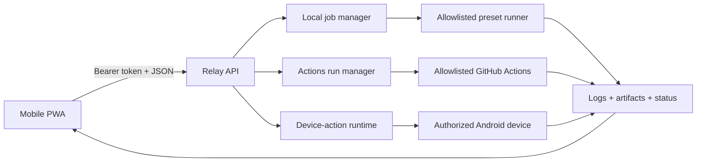

# PocketForge Relay

> Carry the control plane, not the workstation.

**English** · [한국어](README.ko.md) · [日本語](README.ja.md)

PocketForge Relay is an open-source, mobile-first control plane for starting,
observing, and verifying software builds from a phone while the actual work runs
on a local, self-hosted, or cloud runner.

The phone should command the development loop, not imitate a laptop.

## Why this exists

Mobile editors, remote shells, hosted workspaces, and coding agents each solve a
part of mobile development. PocketForge Relay connects the provider-neutral
evidence loop:

```text
change -> build -> test -> artifact -> verify -> iterate
```

It does not replace Android Studio, VS Code, Termux, Codex, Claude Code, or CI.
It coordinates those tools through explicit adapters and bounded runner
capabilities.

## Working MVP

The current Node.js MVP includes:

- an installable mobile-first PWA with English, Korean, and Japanese UI;
- bearer-token authentication for API routes;
- bounded waiting, execution, logs, artifacts, and completed-record retention;
- a separate workspace for every job;
- allowlisted build presets instead of arbitrary shell input;
- Server-Sent Events for logs and state changes;
- authenticated artifact downloads and a zero-dependency bundled demo;
- Node.js, Android Gradle, and CMake presets;
- a child-process environment allowlist, defensive secret redaction, and
  asynchronous shutdown that waits for process and artifact finalization;
- an optional, disabled-by-default GitHub Actions adapter with exact target and
  ref allowlists, expiring approval, status/cancel APIs, and bounded ZIP
  evidence downloads; and
- an optional, disabled-by-default Android device-evidence path with reviewed
  APK snapshots, one-shot approval, authenticated evidence downloads, restart
  recovery, and explicit evidence deletion.

The Android PWA review shows the repository and resolved commit when recorded,
plus the APK digest, package/version, and opaque device identity before approval. Approval secrets
remain in browser memory and fixed API routes never accept ADB commands or
filesystem paths.

The process runner is **not a hardened sandbox**. Only run trusted repositories
until container or micro-VM isolation is implemented.

## Quick start

Requirements: Node.js 22 or newer and Git.

```powershell
$env:POCKETFORGE_TOKEN = "replace-with-a-long-random-token"
npm start
```

Open <http://127.0.0.1:8787>, enter the token, select **Bundled web demo**, and
launch the build loop. The demo returns:

- `dist/index.html`
- `dist/build-report.json`
- `.pocketforge-result/build-summary.json`

To connect from a phone on the same trusted network:

```powershell
$env:POCKETFORGE_TOKEN = "replace-with-a-long-random-token"
$env:HOST = "0.0.0.0"
npm start
```

Then visit `http://<PC-LAN-IP>:8787`. Do not expose the MVP directly to the
public internet.

The Actions and Android integrations stay disabled unless all of their
server-owned configuration is supplied. See
[`docs/GITHUB_ACTIONS.md`](docs/GITHUB_ACTIONS.md),
[`docs/ANDROID_DEVICE_EVIDENCE.md`](docs/ANDROID_DEVICE_EVIDENCE.md), and
[`docs/CONFIGURATION.md`](docs/CONFIGURATION.md).

## Verify

```powershell
npm run check
npm test
```

The repository distinguishes implemented behavior from behavior exercised in a
specific environment. See [the verification record](docs/VERIFICATION.md).

## Architecture



Detailed contracts and trust boundaries live under [`docs/`](docs/).

## Current boundaries

The automated suite exercises the local orchestration, Actions adapter contract,
Android adapter contract, authenticated APIs, mobile UI contract, and
localization parity with fakes and local fixtures. It does **not** establish:

- hardened isolation for untrusted repositories;
- a real Android SDK/JDK build;
- installation, launch, logcat, crash, or screenshot capture on a physical
  Android device;
- a live GitHub Actions dispatch, cancellation, or remote artifact download;
- a real project-specific native CMake build;
- multi-user authorization, private-repository access, or safe public-internet
  exposure.

Real Android SDK/device checks and live GitHub Actions checks are **NOT RUN** in
the current verification environment. They must not be represented as working
from unit-test evidence alone.

## Contributing

Small, reviewable adapters, parsers, examples, tests, security improvements, and
documentation fixes are welcome. Read [`CONTRIBUTING.md`](CONTRIBUTING.md) and
the [`SECURITY.md`](SECURITY.md) reporting policy before contributing. See
[`docs/LOCALIZATION.md`](docs/LOCALIZATION.md) for translation rules.

## License

Apache License 2.0. See [`LICENSE`](LICENSE).
