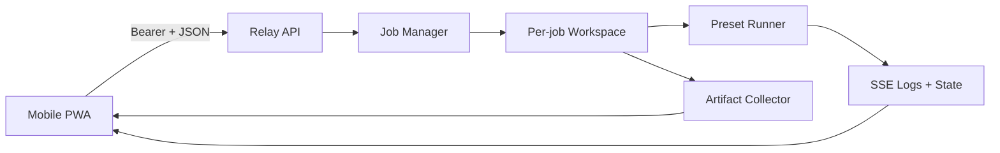
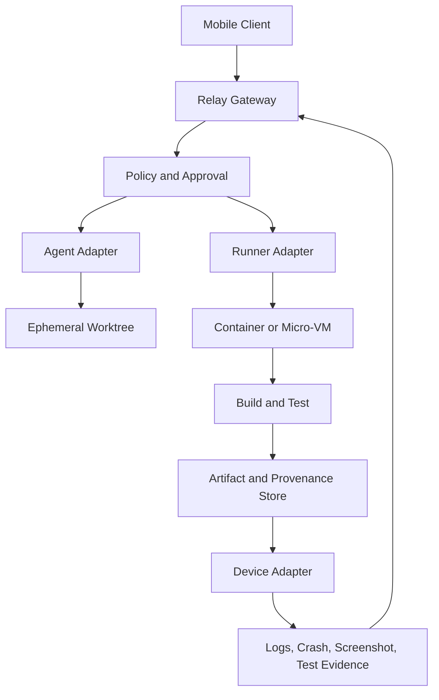

# Architecture

PocketForge Relay separates the **control surface** from the **execution surface**. The phone expresses intent, approvals, and review decisions. The relay authenticates, validates, queues, and emits state. Runners execute allowlisted work. Artifact and device adapters return evidence.

Target architecture:

The MVP keeps jobs in memory and artifacts on disk. The next persistence slice should use an append-only event log with a current-state projection. External protocol messages should eventually include schema version, stable event type, correlation identifiers, authoritative timestamp, and adapter capability version.
