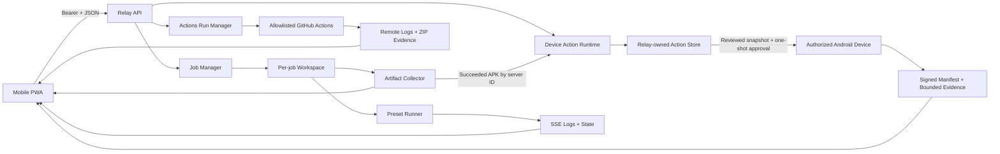
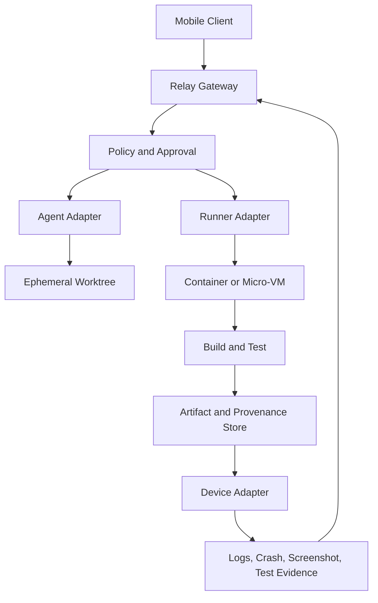

# Architecture

Durable job histories have an explicit retention boundary: only a terminal
history can be deleted, and the authenticated caller must send the literal
`delete` decision. The relay never interprets absence of a decision as consent.

PocketForge Relay separates the **control surface** from the **execution surface**. The phone expresses intent, approvals, and review decisions. The relay authenticates, validates, queues, and emits state. Runners execute allowlisted work. Artifact and device adapters return evidence.

Target architecture:

The MVP keeps a bounded number of completed job records in memory and artifacts
on disk. It also appends bounded, public-safe protocol-v1 events to one regular
file per job. Authenticated history reads verify the file and ordered records,
including after restart, but do not restore jobs or resume processes. Waiting
work is bounded separately, and active work is never evicted. Graceful shutdown
stops admission, cancels waiting and active jobs, then waits for their process,
artifact-finalization, and event-flush paths. The next persistence slice should
add a current-state projection and explicit retention lifecycle. External protocol
messages should eventually include schema version, stable event type,
correlation identifiers, authoritative timestamp, and adapter capability
version.

The local artifact collector calculates SHA-256 through the opened artifact
handle and publishes that collection-time digest in job state and the download
response. It rejects identity or metadata drift during hashing. Downloads repeat
the opened-handle identity, metadata, and SHA-256 checks before sending headers.
Local artifacts are not yet immutable snapshots, so clients must still verify
downloaded bytes against the advertised digest.

The optional Actions run manager is a separate admission and state boundary. It
accepts only server-configured targets, derives every workspace under
`POCKETFORGE_DATA_DIR/action-runs`, and never puts its GitHub credential or
absolute paths in public or append-only durable state. Completed runs, bounded
logs, and retained artifact metadata are restart-readable. A durable
non-terminal run is finalized as `needs_attention` after restart without remote
redispatch or process resumption. Shutdown aborts and waits for observation but
does not claim an already-dispatched workflow was remotely cancelled.
Terminal Actions data is deleted only through an explicit authenticated request;
the fixed UUID workspace is quarantined beneath its owned root before recursive
removal, then the matching durable event log is deleted.

The optional device-action runtime is also disabled by default. It resolves a
succeeded job and APK artifact by server-issued identifiers, snapshots that APK
into a canonically contained action store outside the job workspace, and returns
one approval secret only once. Public state contains the repository and resolved
commit when recorded, APK digest/package/version, and opaque device identity, but no ADB serial,
tool path, workspace path, action-store path, or approval secret. Fixed
authenticated routes provide list, prepare, approve, status, evidence download,
and explicit evidence deletion operations; request bodies never select a command
or filesystem path.

The proposal-only agent core accepts only server-issued local-job or Actions-run
identifiers and a fixed intent. It resolves and bounds evidence inside the
relay, exposes that exact payload for explicit one-shot consent, then validates
provider output as non-executable structured advice. It imports no filesystem
or process runner and is not wired to a production provider by default.

Terminal Android evidence uses an HMAC-authenticated manifest plus exact byte
sizes and SHA-256 digests for retained files. Startup scans the action store,
rejects unexpected, linked, escaping, or invalid entries, verifies complete
terminal bundles, removes abandoned approved-APK snapshots and known regular
partial files left before manifest commit, and restores only verified public
records. Each download repeats canonical-path and bundle verification. Evidence
deletion instead repeats canonical containment and fixed-entry validation.
Deletion is an explicit authenticated operation; there is no automatic
retention sweeper.

The PWA is a single browser control surface for local jobs, GitHub Actions, and
Android device actions. English, Korean, and Japanese use one key-parity-tested
catalog. Only the selected locale may persist in `localStorage`; relay tokens
use `sessionStorage`, while Actions and Android approval secrets remain in
JavaScript memory.
